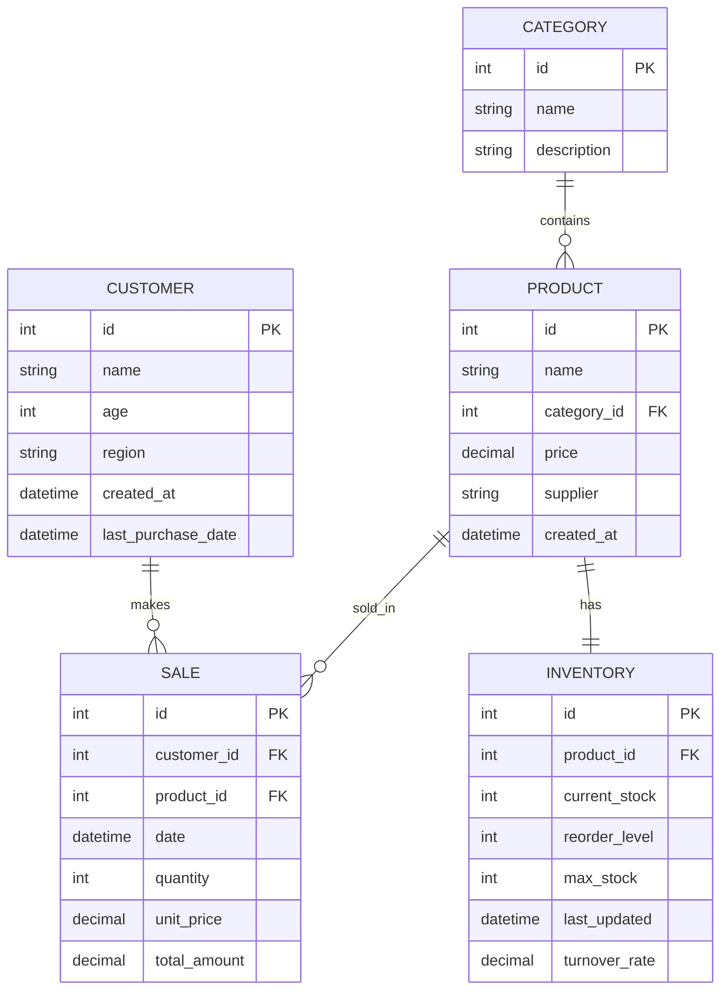

# Retail Network Ontology Model

## Entities and Relationships

## Entity Descriptions

### Customer
- Represents individual customers in the retail network
- Tracks basic demographics and purchase behavior
- Enables customer segmentation and churn analysis

### Category
- Product categorization for business analysis
- Allows grouping of products for insights
- Supports category-based filtering and reporting

### Product
- Individual items sold by the retail network
- Links to categories and suppliers
- Core entity for inventory and sales tracking

### Sale
- Transaction records between customers and products
- Captures temporal purchase patterns
- Enables revenue and trend analysis

### Inventory
- Current stock levels and management metrics
- Tracks turnover rates and reorder points
- Supports inventory optimization insights

## Key Relationships

1. **Customer-Sales**: One-to-many relationship enabling customer behavior analysis
2. **Product-Sales**: One-to-many relationship for product performance tracking
3. **Category-Product**: One-to-many relationship for category-based insights
4. **Product-Inventory**: One-to-one relationship for stock management

## Business Questions Supported

1. **Customer Analytics**:
   - Who are our most valuable customers?
   - Which regions have the highest purchasing power?
   - What are customer churn patterns?

2. **Product Performance**:
   - Which products are top sellers?
   - How do categories perform across regions?
   - What are the price elasticity patterns?

3. **Inventory Optimization**:
   - Which products have low turnover rates?
   - What are optimal reorder levels?
   - Which items are at risk of stockout?

4. **Sales Insights**:
   - What are seasonal trends?
   - How do customer demographics affect purchasing?
   - Which product combinations are frequently bought together?
